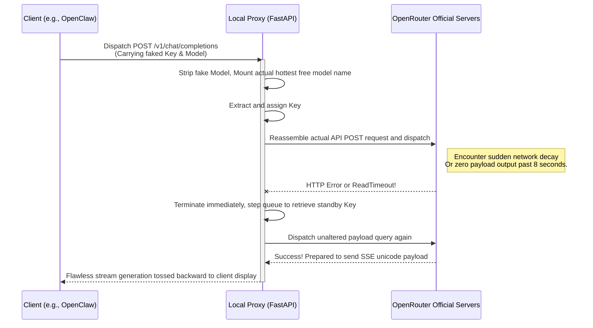

# OpenClaw FreeToken Skill 🆓⚡

[中文文档](README_zh.md) | English

[](https://opensource.org/licenses/MIT)
[](https://www.python.org/downloads/)
[](https://fastapi.tiangolo.com)

**OpenClaw FreeToken** is a **Local Proxy Skill** designed for [OpenClaw](https://github.com/openclaw/openclaw) (or any LLM client compatible with the OpenAI API specification).

Its core mission: **Elegantly utilize the massive library of free large models on OpenRouter, while solving the frequent downtime, rate-limiting, and timeout issues through underlying dynamic interception, unlocking a seamless streaming and highly available experience.**

---

## ✨ Problem Solved

When using OpenRouter's `free` models, due to heavy global usage, you often encounter:
- ❌ Sudden `HTTP 429 Rate Limit` errors.
- ❌ Connection timeouts where the server refuses to yield characters (Timeout > 10s).
- ❌ `HTTP 502 Bad Gateway` server crashes.

These network faults usually directly break the local client application connection. **The FreeToken proxy solves this entirely using the following techniques:**

1. 🔄 **Extremely Fast Multi-Key Rotation**: When any request runs into a refusal or a hard timeout (defaults to 8 seconds of no response), the Proxy running in the background automatically intercepts the interrupt signal, drops the current task, and switches to the next available API Key to try again in-place. The client remains completely unbothered, and the chat continues to stream smoothly.
2. 🤖 **Smart Selection of the Hottest Free Models**: A built-in scheduled task monitors `https://openrouter.ai/api/v1/models`, automatically scraping models with `pricing = 0` and pinning the most optimal models as the enforced primary. Whatever the name of the model you configure in OpenClaw, it is silently forwarded to the best free engine available.
3. ⚡ **Transparent SSE Streaming Catch-up**: Unlike a normal JSON HTTP Response, this proxy utilizes deep `httpx.AsyncClient` capabilities to perform millisecond-level loss-free relay of Server-Sent Events (SSE). It ensures every character streamed out is as smooth as a direct connection.

## 📦 Installation & Configuration

1. Clone or download this repository to your local machine (preferably inside the `skills` directory of OpenClaw):
   ```bash
   git clone https://github.com/your-username/openclawfreetoken.git
   cd openclawfreetoken
   ```

2. Install the extremely lightweight underlying dependencies:
   ```bash
   pip install -r requirements.txt
   ```

3. **Configure Your API Keys Pool**:
   Create a `keys.json` file (it is inherently ignored by Git to ensure safety), and array-insert your multi-registered OpenRouter API Keys into it:
   ```json
   [
     "sk-or-v1-your_first_secret_key",
     "sk-or-v1-your_second_secret_key",
     "sk-or-v1-your_third_secret_key"
   ]
   ```

## 🚀 Usage

### Method 1: OpenClaw Skill Execution (Fully Automated)

If you are an **OpenClaw** agent user, it possesses the capability to read built-in Skills. Because of the `SKILL.md` provided in this directory, the main agent will automatically complete dependency probing, pull up the proxy background instance, and automagically mutate its own configuration parameters when compute power gets starved—achieving **zero-config cloud docking**.

### Method 2: Manual Execution (Universal for ANY LLM Client)

As an independent local upgrade component, you can separate it from OpenClaw entirely and use it anywhere:
1. Boot up the local proxy mounting daemon:
   ```bash
   uvicorn proxy:app --host 127.0.0.1 --port 8000
   ```
   *(The background service captures the updated free server list upon start, displaying `[*] Fetched and updated current free model...` upon success)*

2. Modify your client application (AnythingLLM / ChatGPT-Next-Web / Cursor, etc.) to target the proxy:
   - **API Base URL**: `http://127.0.0.1:8000/v1`
   - **API Key**: Enter absolutely any string here! (e.g., `sk-mock`) The proxy logic will wipe it and attach the genuine keys sequentially.
   - **Model**: Also enter it casually! (e.g., `qwen-free`) Once the request dispatches, the proxy forcefully hijacks and restructures it to the optimal model.

## ⚙️ Architecture & Sequence

Through intercepting and altering payloads, seamless local take-over is performed:



## 📜 License
Distributed under the **MIT License**. Free and open-source, helping individuals obtain their private transit lanes in this computing famine era.
