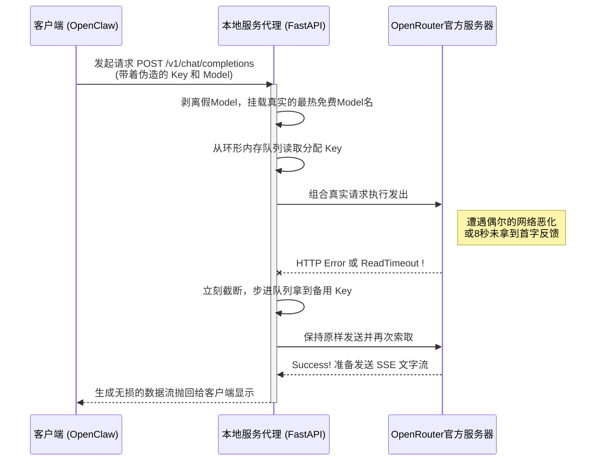

# OpenClaw FreeToken Skill 🆓⚡

中文文档 | [English](README.md)

[](https://opensource.org/licenses/MIT)
[](https://www.python.org/downloads/)
[](https://fastapi.tiangolo.com)

**OpenClaw FreeToken** 是一个专为 [OpenClaw](https://github.com/openclaw/openclaw)（或任何兼容 OpenAI API 规范的 LLM 客户端）设计的**本地代理挂载包 (Local Proxy Skill)**。

它的核心使命是：**优雅地使用 OpenRouter 上的海量免费大模型，并通过底层动态拦截解决免费 API 频发的宕机与限流问题，让客户端享受无缝流式响应的高可用体验。**

---

## ✨ 核心痛点与解决方案

在使用 OpenRouter 的 `free` 模型时，由于全球用户极大，经常遭遇：
- ❌ 突发的 `HTTP 429 Rate Limit`（请求过载限制）
- ❌ 服务器处理过载导致迟迟不吐字的连接超时（Timeout > 10s）
- ❌ `HTTP 502 Bad Gateway`（服务器崩溃）

这些网络故障一般会直接引起本地客户端强行崩断并报错。**FreeToken 代理程序会通过如下黑科技帮你彻底屏蔽这些不适：**

1. 🔄 **极速多 Key 轮询容灾**：当任一请求遭遇拒绝或硬超时（默认 8 秒无响应），Proxy 挂在后台会自动拦截中断信号，原地切换成下一个备用 API Key 再次出发。客户端完全无感，对话继续平滑输出。
2. 🤖 **智能锁取最热免费模型**：内置定时任务监控 `https://openrouter.ai/api/v1/models`，自动爬取 `pricing = 0` 且优质的模型作为强制主力。不管你在 OpenClaw 中配置了什么名字的模型，都会被静默转发至选定的免费引擎。
3. ⚡ **全流式 SSE 透明接管**：不同于传统的 HTTP Response，代理使用了最深度的 `httpx.AsyncClient`，毫秒级无损中继 Server-Sent Events（服务端推送），保证流出来的每个字像直连一样通畅。

## 📦 安装与配置 (Installation)

1. 将本仓库克隆或下载到本地，建议放置在 OpenClaw 的 Skills 辅助目录下：
   ```bash
   git clone https://github.com/your-username/openclawfreetoken.git
   cd openclawfreetoken
   ```

2. 安装非常轻量级的基础依赖库：
   ```bash
   pip install -r requirements.txt
   ```

3. **配置你的护城河密钥池**：
   找到或新建 `keys.json` 文件（该文件已被内置排除出 Git 追踪列表确保安全），将你在 OpenRouter 注册获取的多个 API Key 填入数组：
   ```json
   [
     "sk-or-v1-第一个秘钥",
     "sk-or-v1-第二个秘钥",
     "sk-or-v1-第三个秘钥"
   ]
   ```

## 🚀 启动与接入 (Usage)

### 方式一：接入 OpenClaw Skill（完全自动化云对接）

如果你是 **OpenClaw** 的智能体使用者，它拥有阅读内置 Skill 的能力。只需存在本目录里的 `SKILL.md`，主脑智能体便可在被你唤醒时自动完成依赖探测、代理后台拉起、自身配置参数魔改的活计，实现真正的**云对接零配置**体验。

### 方式二：手动运行（任意 LLM 客户端通用）

作为独立的本地增强组件，你也可以脱离 OpenClaw 手动运行它：
1. 启动本地代理挂载守护进程：
   ```bash
   uvicorn proxy:app --host 127.0.0.1 --port 8000
   ```
   *(服务会在启动时捕获一次最新免费服列表，屏幕提示 `[*] Fetched and updated current free model...` 即大功告成)*

2. 将你的客户端应用（AnythingLLM / ChatGPT-Next-Web / Cursor 等任何支持自定义下放的大模型端）修改为：
   - **基础地址 (API Base URL)**: `http://127.0.0.1:8000/v1`
   - **验证密钥 (API Key)**: 这里随便填写任何字符串！(如: `sk-mock`) 代理底层会抹除它并使用真实的 Key。
   - **请求模型 (Model)**: 随便填写！(如: `qwen-free`) 请求发出后代理强制劫持重组为最优型号。

## ⚙️ 设计与原理时序图

通过拦截篡改层，完成本地无感接管：



## 📜 许可证 (License)
基于 **MIT License** 发行。免费开源，助诸位在算力紧缺时代拥有个人专列。
